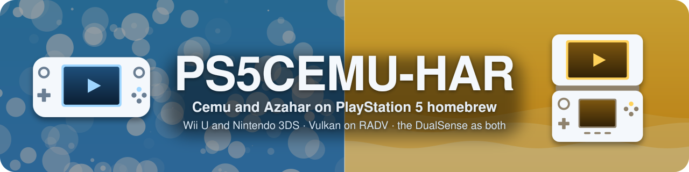

<p align="center">
  
</p>

<p align="center">
  <strong>An unofficial Cemu port for PlayStation 5 homebrew</strong><br>
  <a href="#features">Features</a> · <a href="#install">Install</a> · <a href="#in-game-controls">Controls</a> ·
  <a href="docs/BUILDING.md">Building</a> · <a href="#credits">Credits</a>
</p>

**PS5Cemu is an unofficial PlayStation 5 port of [Cemu](https://github.com/cemu-project/Cemu)**, the
Wii U emulator. All credit for the emulator belongs to the Cemu team and its contributors. PS5Cemu
is not affiliated with or endorsed by the Cemu project, Nintendo or Sony.

This is an early alpha. On a console with etaHEN, PS5Cemu starts into its launcher, lists your
games and starts them, and The Wind Waker HD plays: video, controller input and saves work.
Compatibility and performance will vary between games. The latest release is
**[v0.2.0](https://github.com/premohq/PS5CEMU/releases/tag/v0.2.0)**.

## Source code

The complete PS5Cemu source is in this repository: the console layer, Cemu's platform code, the
launcher and the in-game menu in `port/`, the port's changes to Cemu in `patches/cemu/`, and the
build, packaging and artwork tools in `tools/`. To build it yourself, run `make release` on Linux
(Ubuntu 24.04; WSL works). It fetches every dependency at its pinned revision and writes the app to
`build/app/PPSA99360` and its ZIP to `dist/`; `make help` lists the other targets. See
[docs/BUILDING.md](docs/BUILDING.md).

## Project foundation

> [!IMPORTANT]
> **The emulator is [Cemu](https://github.com/cemu-project/Cemu).**
> Its core, x64 recompiler and Vulkan renderer run natively on the console. The port's changes to
> Cemu's own files are in `patches/cemu/`.

> [!IMPORTANT]
> **Vulkan is powered by Mihawk's [PS5 Mesa](https://github.com/mihawk-99/PS5_Mesa) and [PS5 Vulkan](https://github.com/mihawk-99/PS5_Vulkan).**
> Mihawk's Mesa/RADV driver for the PS5 runs Cemu's Vulkan renderer. Many thanks to Mihawk for this
> work and for [all of the PS5 projects](https://github.com/mihawk-99) behind it.

> [!IMPORTANT]
> **Built on BlackBearReloaded's [PS5 Native App Boilerplate](https://github.com/blackbearreloaded/ps5-native-app-boilerplate) and [ProsperoEden](https://github.com/blackbearreloaded/ProsperoEden).**
> The boilerplate provides the native app's runtime, packaging and sandbox elevation, and
> ProsperoEden the launcher's design, artwork, fonts and software drawing.

> [!IMPORTANT]
> **Dressed in the [Wii U Homebrew Launcher](https://github.com/dimok789/homebrew_launcher)'s blue, by Dimok.**
> Its background is behind the launcher, on the PS5's home screen and at the top of this page.

## Features

- **Native Cemu** - Cemu's x64 recompiler runs with the JIT memory etaHEN grants. Without it, games
  fall back to Cemu's interpreter, which is much slower.
- **Vulkan renderer** - Cemu's Vulkan renderer on Mihawk's RADV driver, at the console's 3840x2160
  output with the upscaling filter you choose (Bicubic by default), and 120 Hz on displays that take it.
- **Launcher** - ProsperoEden's layout, artwork and fonts, adapted for Wii U games, on the Wii U
  Homebrew Launcher's background: **Continue Playing**, **Recently Played**, and a **Library** with
  each game's icon, version, update and DLC.
- **Game files anywhere** - WUA, WUD/WUX and unpacked games in any folder the PS5 can read, chosen
  with a folder browser in **Settings > Game files**.
- **Graphic packs per game** - the community graphic packs are bundled. Turn them on or off and pick
  their presets for each game, as in Cemu's Graphic Packs window.
- **Both screens** - the TV's picture or the GamePad's as the main one, and the other one in a corner
  when you want it.
- **The touchpad as the touch screen** - a cursor shows where your finger is on the GamePad's
  picture. Click to touch, and keep it clicked to drag.
- **In-game menu** - the main screen, the screen in a corner, upscaling, the picture's shape, the
  performance overlay, the volume, and back to the library.
- **Text entry** - games that ask for text get Cemu's keyboard, typed with the D-pad or the touchpad.
- **Controllers, audio and saves** - player 1's DualSense is the Wii U GamePad, with motion controls
  and vibration, and other signed-in users get Pro Controllers, up to four players. Audio plays
  through the PS5's AudioOut, and saves stay in `/data/ps5cemu`.

## Install

1. Download the release ZIP and extract it, or build it yourself ([docs/BUILDING.md](docs/BUILDING.md)).
2. Copy the included `PPSA99360` folder to `/data/homebrew/PPSA99360` on the PS5.
3. Load **etaHEN** and add `PPSA99360` to its app jailbreak list. This gives PS5Cemu `/data` and JIT
   memory. If the HEN does not jailbreak it, PS5Cemu asks elfldr to run its bundled
   `sandbox-elevator.elf`, which grants `/data` only, so games run on the interpreter.
4. Put your own Wii U game dumps in `/data/ps5cemu/games`, or in any folder the PS5 can read and
   select it in **Settings > Game files**.
5. Launch **PS5Cemu** and open the **Library**.

### Game files

```text
<game files folder>/                # /data/ps5cemu/games by default
├── Game.wua                        # a Wii U archive: the game, its update and DLC in one file
├── Game.wux                        # or Game.wud
└── Game/                           # an unpacked game
    ├── code/
    ├── content/
    └── meta/
```

Encrypted WUD and WUX dumps also need their disc keys in `/data/ps5cemu/keys.txt`, as Cemu reads
them. Updates and DLC installed in the Wii U's storage (`mlc01`) are found with their game.

### App data

PS5Cemu keeps everything it writes in `/data/ps5cemu`, separately from the game files:

```text
/data/ps5cemu/
├── settings.xml, ps5cemu.json      Cemu's settings and the launcher's
├── controllerProfiles/             controller profiles
├── mlc01/                          the Wii U's storage: installed updates and DLC, saves
├── games/                          the default game files folder
├── keys.txt                        disc keys for encrypted dumps
├── graphicPacks/                   community packs (downloadedGraphicPacks/) and your own
├── cache/                          shader and pipeline caches
├── covers/                         game icons for the launcher
├── log.txt                         Cemu's log
└── logs/boot.log                   PS5Cemu's log (boot.prev.log: the session before)
```

**Saves from Cemu on a PC.** Copy a game's save folder from your PC's
`mlc01/usr/save/00050000/<title ID>/user/<account>` to
`/data/ps5cemu/mlc01/usr/save/00050000/<title ID>/user/80000001`, PS5Cemu's account, while that
game is not running.

**Updating.** Copy a new release's `PPSA99360` folder over the old one; your data in
`/data/ps5cemu` stays. To see a new home screen tile or background, refresh PS5Cemu in the loader
that registered it.

PS5Cemu includes no games, keys, firmware or other copyrighted console data. Dump them from
hardware and software you own. Do not download or redistribute them.

## In-game controls

| Control | Action |
|---|---|
| Touchpad | A cursor on the GamePad's screen: click to touch, keep it clicked to drag |
| Touchpad click + Options | The PS5Cemu menu |
| Touchpad click + L1 | The TV or the GamePad as the main screen |
| Touchpad click + R1 | The other screen in a corner, or not |

In the menu, the D-pad moves, Cross chooses, Left and Right change a setting, and Circle goes back
to the game. On Cemu's keyboard, the D-pad moves, Cross types, Circle deletes, Triangle is shift
and Options is done. On both, the touchpad points and clicks.

## Changes in v0.2.0

- **Games run at their own speed.** Cemu took the console clock's 81 ns resolution for the unit of
  its timers, so they ran 81 times too fast, and games ran as fast as the display let them: The
  Wind Waker HD at 60 fps, twice its speed.
- **The GamePad's screen.** Make it the main picture, or show it in a corner of the TV's, from the
  in-game menu or with the touchpad shortcuts.
- **A cursor for the touch screen.** The touchpad moves a cursor over the GamePad's picture and
  touches where you click, instead of touching wherever a finger rests.
- **In-game menu.** Touchpad + Options opens it. Going back to the library moved there from
  touchpad + L1 (twice), and the performance overlay from touchpad + R1.
- **Cemu's keyboard works.** Games that ask for text, such as for a name, can be typed into with the
  D-pad and Cross or the touchpad, at a size that suits the 4K output.
- **The PS5's home screen.** The tile and the background behind PS5Cemu when it is selected use the
  Wii U Homebrew Launcher's blue, with the app's GamePad and name.

## Changes in v0.1.0

- **PS5Cemu starts on a console.** Two crashes before the launcher appeared are fixed: Vulkan
  functions the PS5's driver gives out only for an instance, and an app folder that is not `/app0`
  once etaHEN jailbreaks the app.
- **The launcher shows.** It draws in software through SDL, as ProsperoEden does, and lists your
  games.
- **Games start.** Cemu's renderer asks the driver's instance for its device extensions, and a fiber
  switch that went back to a stale stack frame, which crashed The Wind Waker HD a moment after it
  started, is fixed.
- **Crash reports.** `log.txt` names where a crashed thread stopped.
- **The Wii U Homebrew Launcher's background**, darkened, replaces the launcher's palm trees.

## Roadmap

- **Pause from the in-game menu** - the game keeps running behind the menu for now.
- **Graphic packs during a game** - change packs and presets without going back to the library.
- **Back to the library without a restart** - leaving a game starts PS5Cemu over, since Cemu cannot
  yet end a game and start another in one process.
- **Motion controls checked on a console** - the DualSense's gyro and accelerometer axes, as games
  expect the GamePad's.
- **More game compatibility** - try more games on the console, and fix what keeps them from running
  well.

## Extras

`extras/ps5mfr` is [PS5 Make FSELF Recursive](https://github.com/alex-free/ps5-make-fself-recursive)
by Alex Free. It is kept in this repository with its own readme and licence.

## Credits

- **Cemu**, by the Cemu team and contributors (MPL-2.0).
- **ProsperoEden** by BlackBearReloaded: the launcher's design, artwork, fonts, bitmap font engine,
  folder browser and software drawing through SDL, and the **PS5 Native App Boilerplate**: runtime,
  packaging tool, sandbox elevation and the home screen's asset format.
- **Dimok**: the Wii U Homebrew Launcher's background (homebrew_launcher and libgui, GPL-3.0), drawn
  by `tools/render-background.py` for the launcher, the home screen and this page.
- **Mihawk**: RADV on the PS5 (PS5_Mesa, PS5_Vulkan, the payload SDK fork), with **mpereiraesaa**'s
  contributions.
- **John Törnblom** (ps5-payload-dev): the [PS5 Payload SDK](https://github.com/ps5-payload-dev/sdk),
  and **pacbrew**'s PS5 libraries.
- **Swordpdf**: PS5SX2's etaHEN jailbreak request, which PS5Cemu follows.
- The authors of the **[Cemu community graphic packs](https://github.com/cemu-project/cemu_graphic_packs)**.

## License

PS5Cemu's own code is licensed under GPL-3.0-or-later; see [LICENSE](LICENSE). Files derived from
Cemu keep Cemu's MPL-2.0, as their headers say, and third-party components keep their own licences.

## Disclaimer

- **No affiliation.** This is an independent homebrew project. It is not affiliated with, endorsed
  by, or sponsored by Sony Interactive Entertainment, Nintendo or the Cemu project. "PlayStation"
  and "PS5" are trademarks of Sony Interactive Entertainment Inc., and "Wii U" is a trademark of
  Nintendo.
- **No proprietary material.** No Sony or Nintendo SDK, firmware, encryption keys, games or
  decrypted system modules are included.
- **No warranty.** This project is provided "as is", without warranty of any kind, to the extent
  permitted by law. See sections 15 and 16 of the GPL.
- **Use at your own risk.** Running homebrew requires a modified console, which may void its
  warranty, breach the platform's terms of service, or cause data loss.
- **Legal use only.** Use it only with hardware, accounts and content you own. This project does
  not support or enable piracy.

## AI assistance

This project was developed with AI assistance from Anthropic's Claude.
